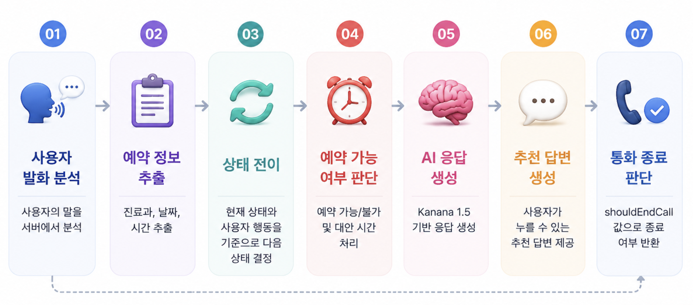
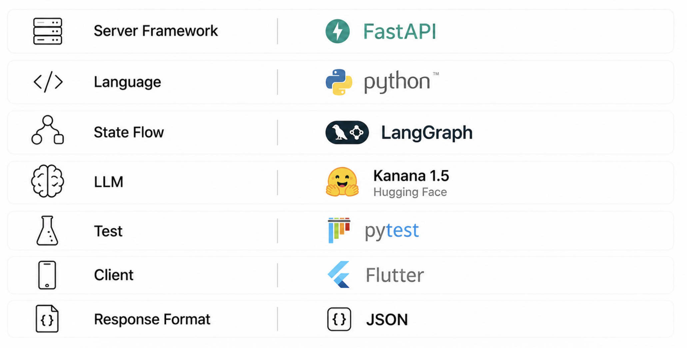
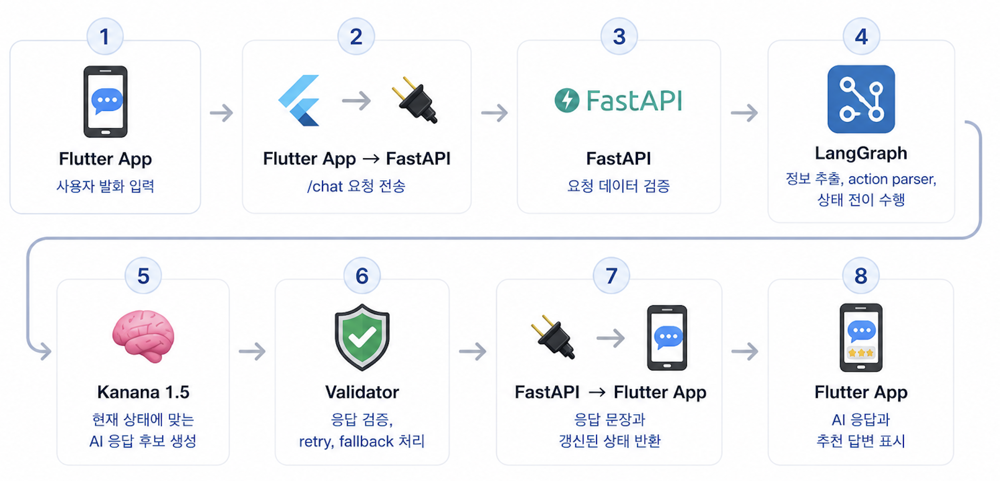

<div align="center">

# MaeumCall AI Server

### 마음콜 고도화 프로젝트 · LangGraph 기반 AI 통화 시뮬레이션 서버

통화가 어려운 사용자가 실제 전화 상황을 연습할 수 있도록  
사용자 발화를 분석하고, 시나리오 상태를 관리하며,  
AI 응답과 추천 답변을 생성하는 서버입니다.

<br/>


<br/>
<br/>

</div>

---

## 목차

1. [프로젝트 소개](#1-프로젝트-소개)
2. [핵심 기능](#2-핵심-기능)
3. [기술 스택](#3-기술-스택)
4. [서버 구조](#4-서버-구조)
5. [API 흐름](#5-api-흐름)
6. [Main API](#6-main-api)
7. [LangGraph 적용 구조](#7-langgraph-적용-구조)
8. [테스트 및 검증](#8-테스트-및-검증)
9. [프로젝트 구조](#9-프로젝트-구조)
10. [실행 방법](#10-실행-방법)
11. [문서](#11-문서)
12. [구현 결과 요약](#12-구현-결과-요약)

---

## 1. 프로젝트 소개

MaeumCall AI Server는 기존 마음콜 프로젝트를 상태 기반 AI 시스템으로 고도화한 통화 공포 완화 앱의 AI 서버입니다.

사용자가 통화 상황에서 말한 내용을 서버로 전달하면, 서버는 현재 시나리오 상태를 판단하고 다음 AI 응답을 생성합니다.

단순히 LLM에게 답변 생성을 맡기는 구조가 아니라, 상세 흐름 16개와 등록형 시나리오 흐름 16개를 LangGraph로 오케스트레이션합니다. 중앙 실행 레지스트리가 32개 시나리오를 상세·등록형 중 정확히 하나의 계약에 연결하며, 중복이나 미등록 조합을 명시적으로 차단합니다. 상세 그래프는 검증된 구조화 출력만 상태 전이에 사용하고, 확정된 서버 상태는 도메인 응답 정책으로 표현합니다. 모델 계약 위반은 제한 재시도 후 명시적 API 오류로 처리합니다.

모든 대화 응답에는 실제 외부 시스템에 영향을 주지 않는 시뮬레이션이라는 메타데이터를 포함합니다. 배달·시청·고객센터는 사용자 최종 확인 뒤 환불 승인, 안내 완료, A/S 접수 같은 모의 결과까지 진행하되 결과 문장에도 실제 반영이 없음을 명시합니다.

<p align="center">
  
</p>

<table>
  <tr>
    <td>
      <strong>🎯 핵심 목표</strong><br/>
      마음콜 AI Server는 사용자가 실제 전화 상황을 단계적으로 연습할 수 있도록
      <strong>사용자 발화 분석 → 상태 판단 → LLM 응답 생성 → 추천 답변 제공</strong>까지 이어지는
      대화형 통화 시뮬레이션 서버를 목표로 합니다.
    </td>
  </tr>
</table>

---

## 2. 핵심 기능

| 기능 | 설명 |
|---|---|
| 🧠 AI 처리 | 로컬 Kanana 1.5로 상세 시나리오 발화를 구조화하고 OpenAI로 자유 대화 턴 생성 |
| 🔁 LangGraph 상태 전이 | 시나리오별 대화 흐름을 상태 기반으로 관리 |
| 🧾 정보 추출 | 사용자 발화에서 시나리오 진행에 필요한 정보 추출 |
| 🗣 사용자 행동 분류 | 사용자 발화를 confirm, change_time, ask_other_time 등 user_action으로 변환 |
| 🛡 계약 검증 | JSON 형식, 필드 타입, 허용 action을 검증하고 위반 시 제한 재시도 |
| 🚨 명시적 장애 처리 | 모델 미설정·호출 실패·계약 위반을 타입이 있는 5xx 응답으로 전달 |
| 💬 추천 답변 생성 | 현재 상태에 맞는 recommendedReplies 반환 |
| 📦 상태 유지 | 시나리오 키와 스키마 버전이 포함된 scenarioState를 모바일이 보관하고 서버가 매 턴 검증 |
| 📞 통화 종료 제어 | shouldEndCall 값으로 종료 흐름 관리 |
| 🔐 기준선 식별자 보호 | 실제 사용자 ID 대신 비밀키 기반 HMAC 식별자로 음성 기준선 저장 |
| 🪪 사용자 소유권 검증 | 카카오 토큰을 서버에서 검증하고 Firebase ID token의 UID로 사용자 데이터 소유권 확정 |
| 🗄 트랜잭션 기준선 저장 | PostgreSQL 행 잠금과 트랜잭션으로 캘리브레이션 샘플·확정 기준선을 영속화 |
| 📈 실행 관측성 | LangGraph와 TTS의 성공·실패·latency를 개인정보 없는 Prometheus 지표로 노출 |
| 🔊 한국어 TTS | 32개 시나리오 배역을 Qwen3-TTS·Bark Small·Voice Clone의 인증된 24kHz WAV로 제공 |

---

## 3. 기술 스택

아래 이미지는 마음콜 AI Server 구현에 사용한 주요 기술 구성을 정리한 것입니다.

<p align="center">
  
</p>

### 기술 선택 이유

| 기술 | 선택 이유 |
|---|---|
| FastAPI | 비동기 API 서버 구현이 간단하고, `/chat` API처럼 요청/응답 구조가 명확한 서버를 빠르게 구성할 수 있기 때문에 사용했습니다. |
| Python 3.11 | CI와 로컬의 재현성을 맞추고 LangGraph·음성 분석 라이브러리의 검증된 조합을 유지하기 위해 기준 런타임으로 고정했습니다. |
| LangGraph | 단순 프롬프트 호출이 아니라, 예약 시나리오처럼 상태 전이가 필요한 대화 흐름을 명확하게 관리하기 위해 사용했습니다. |
| Kanana 1.5 Hugging Face | 한국어 사용자 발화를 도메인 필드와 action으로 구조화하는 로컬 NLU 경계를 구성하기 위해 사용했습니다. |
| Kiwi 0.23.2 | 조사·어미가 붙는 한국어를 공백이 아니라 형태소와 품사 기준으로 분석하고, 같은 단어의 활용형을 원형 단위로 집계하기 위해 사용했습니다. |
| Pytest | action parser, extractor, graph flow, routing 등 서버 내부 로직을 기능 단위로 검증하기 위해 사용했습니다. |
| Flutter | 실제 앱 클라이언트와 연동되는 구조를 고려해, 서버 응답이 모바일 화면에서 바로 사용될 수 있도록 설계했습니다. |
| JSON | Flutter와 FastAPI 간 데이터 교환 형식으로 사용하며, AI 응답뿐 아니라 상태값과 추천 답변을 함께 전달하기에 적합하다고 판단했습니다. |
| PostgreSQL 18 | 다중 프로세스에서도 사용자별 음성 기준선과 캘리브레이션 샘플을 트랜잭션으로 보존하기 위해 사용했습니다. |
| SQLAlchemy 2 + asyncpg | FastAPI 요청마다 독립 비동기 세션을 사용하고 연결 풀과 명시적 트랜잭션 경계를 관리하기 위해 사용했습니다. |
| Alembic | 운영 데이터베이스의 테이블과 제약조건 변경 이력을 코드와 함께 관리하기 위해 사용했습니다. |
| Prometheus Python Client | LangGraph 노드 지연 시간 분포와 재시도·계약 실패 횟수를 낮은 카디널리티 지표로 수집하기 위해 사용했습니다. |
| Firebase Admin SDK | 모바일이 보낸 Firebase ID token을 신뢰하기 전에 서버에서 서명·만료·프로젝트를 검증하고 UID를 소유권 기준으로 사용하기 위해 선택했습니다. |
| Qwen3-TTS 0.6B CustomVoice | Apache-2.0, 한국어, 9개 고정 음색, 로컬 실행을 지원하며 Apple MPS에서 실제 WAV 합성까지 검증해 선택했습니다. |

<table>
  <tr>
    <td>
      <strong>🧭 기술 선택 방향</strong><br/>
      마음콜 AI Server의 기술 선택 핵심은 단순히 LLM 응답을 생성하는 것이 아니라,
사용자의 발화에 따라 <strong>상태를 전이</strong>하고,
      현재 상황에 맞는 응답인지 <strong>검증</strong>한 뒤,
      안정적인 통화 연습 흐름을 이어갈 수 있도록 만드는 데 있습니다.
    </td>
  </tr>
</table>

---

## 4. 서버 구조

마음콜 AI Server는 사용자 발화를 입력받아 시나리오별 처리 흐름으로 분기하고, 현재 상태에 맞는 AI 응답을 생성하는 구조입니다.

이 섹션에서는 실제 요청 처리 순서보다, 서버 내부의 주요 구성 요소와 역할을 중심으로 설명합니다.

| 영역 | 역할 |
|---|---|
| 📱 Flutter App | 사용자 발화 입력, AI 응답과 추천 답변 표시 |
| 🔌 FastAPI `/chat` | 클라이언트 요청 수신 및 응답 반환 |
| 🚦 Scenario Router | category/title 기준으로 시나리오 처리 흐름 분기 |
| 🔁 LangGraph Flow | 시나리오별 conversationState 관리 |
| 🧾 Extractor | 사용자 발화에서 필요한 정보 추출 |
| 🗣 Action Parser | 사용자 발화를 user_action으로 분류 |
| 🧠 Response Generation | 상세 그래프의 도메인 응답 정책과 등록형 그래프의 구조화된 LLM 턴 생성 |
| 🛡 Contract Enforcement | 구조화 출력 검증, 제한 재시도, 명시적 오류 처리 |
| 💬 Recommended Replies | 현재 상태에 맞는 추천 답변 생성 |
| 🔊 TTS Provider | 고정 모델 리비전과 허용 음색으로 한국어 WAV 생성 |

<table>
  <tr>
    <td>
      <strong>💡 구조 핵심</strong><br/>
      서버는 <strong>요청 수신</strong>, <strong>시나리오 분기</strong>, <strong>상태 처리</strong>, 
      <strong>LLM 응답 생성</strong>, <strong>응답 검증</strong> 계층으로 나뉩니다.
      메인 서버는 공통 API 흐름을 담당하고, 세부 상태 전이는 각 시나리오별 LangGraph에서 관리합니다.
    </td>
  </tr>
</table>

---

## 5. API 흐름

`/chat` API는 사용자 발화와 현재 시나리오 상태를 입력받고, 다음 AI 응답과 갱신된 상태를 반환합니다.

아래 이미지는 클라이언트 요청부터 서버 내부 처리, 최종 응답 반환까지의 전체 흐름을 나타냅니다.

<p align="center">
  
</p>

### 흐름에서 중요한 점

| 항목 | 설명 |
|---|---|
| 요청 기준 | Flutter는 완료된 `turns`와 직전 서버 응답의 `conversationState`, `scenarioState`를 전달 |
| 분기 기준 | 서버는 `category/title`의 등록 키를 기준으로 상세 그래프 또는 등록형 공통 그래프를 선택 |
| 상태 유지 | 서버는 다음 대화를 이어가기 위해 `conversationState`와 `scenarioState`를 함께 반환 |
| 추천 답변 | 현재 상태에서 사용자가 말하기 쉬운 문장을 `recommendedReplies`로 제공 |
| 종료 제어 | 통화가 끝나는 흐름에서는 `shouldEndCall` 값으로 프론트의 종료 처리를 제어 |

<table>
  <tr>
    <td>
      <strong>📌 API 흐름 핵심</strong><br/>
      `/chat` API는 단순히 응답 문장만 반환하지 않습니다.
      다음 발화에서 이어서 사용할 <strong>상태값</strong>과 <strong>추천 답변</strong>까지 함께 반환하여,
      사용자가 하나의 전화 상황을 자연스럽게 이어갈 수 있도록 합니다.
    </td>
  </tr>
</table>

---

## 6. Main API

### POST `/chat`

사용자 발화와 현재 시나리오 상태를 서버로 보내면, 서버는 다음 AI 응답과 갱신된 상태를 반환합니다.

요청 예시:

    {
      "category": "예약",
      "title": "식당 예약",
      "description": "식당 예약 전화 상황",
      "userMessage": "오늘 저녁 7시에 두 명 예약할 수 있나요?",
      "conversationState": "greeting",
      "scenarioState": {},
      "history": []
    }

응답 예시:

    {
      "response": "오늘 저녁 7시 두 분 예약으로 확인했습니다. 예약자 성함은 어떻게 남겨드릴까요?",
      "etiquetteTip": null,
      "recommendedReplies": [
        "김개굴 이름으로 예약해주세요.",
        "예약자는 김개굴입니다.",
        "다른 시간도 가능할까요?"
      ],
      "conversationState": "collecting_reservation_info",
      "shouldEndCall": false,
      "scenarioState": {
        "scenario_key": "예약:식당 예약",
        "state_version": 2,
        "intent": "reservation",
        "date": "오늘",
        "time": "저녁 7시",
        "party_size": "2명",
        "user_name": null,
        "conversation_state": "collecting_reservation_info"
      }
    }

자세한 API 계약은 [api-contract.md](docs/api-contract.md)를 참고합니다.

---

## 7. LangGraph 적용 구조

MaeumCall AI Server는 모든 시나리오를 단일 프롬프트로 처리하지 않습니다. 예약·교수님·배달·시청·고객센터 시나리오는 도메인별 상세 상태 그래프를 사용하고, 가족·친구·연인·회사 시나리오는 선언형 설정 기반 공통 그래프로 일관된 상태·종료·추천 답변을 관리합니다.

메인 README에서는 전체 적용 현황만 간단히 정리하고, 각 카테고리별 상세 설계는 별도 README에서 관리합니다.

| 카테고리 | LangGraph 적용 상태 | 상세 문서 |
|---|---|---|
| 📞 예약 | ✅ 도메인별 상세 그래프 4개 | [Reservation README](services/flow/reservation/README.md) |
| 🎓 교수님 | ✅ 도메인별 상세 그래프 3개 | [Professor README](services/flow/professor/README.md) |
| 🏢 회사 | ✅ 선언형 공통 그래프 4개 | [Flow README](services/flow/README.md) |
| 👪 가족 | ✅ 선언형 공통 그래프 3개 | [Flow README](services/flow/README.md) |
| 🧑‍🤝‍🧑 친구 | ✅ 선언형 공통 그래프 5개 | [Flow README](services/flow/README.md) |
| 💑 연인 | ✅ 선언형 공통 그래프 4개 | [Flow README](services/flow/README.md) |
| 🎧 고객센터 | ✅ 업무별 상세 그래프 3개 | [Flow README](services/flow/README.md) |
| 🛵 배달 | ✅ 업무별 상세 그래프 3개 | [Flow README](services/flow/README.md) |
| 🏛 시청 | ✅ 업무별 상세 그래프 3개 | [Flow README](services/flow/README.md) |

<table>
  <tr>
    <td>
      <strong>💡 문서화 원칙</strong><br/>
      메인 README는 프로젝트 전체 구조와 적용 현황만 요약합니다.
      시나리오별 상태 설계, 노드 구성, 테스트 결과, 트러블슈팅은
      각 카테고리 README에서 관리합니다.
    </td>
  </tr>
</table>

---

## 8. 테스트 및 검증

32개 전체 모바일 시나리오의 라우팅, 상태 전이, 구조화 출력 계약, 재시도·오류 응답, API 계약을 검증합니다. 실모델 테스트는 기본 테스트와 분리해 수동 실행합니다.

| 테스트 구분 | 검증 내용 |
|---|---|
| 🧩 Action Parser Test | 사용자 발화를 user_action으로 올바르게 분류하는지 검증 |
| 🧾 Extractor Test | 시나리오 진행에 필요한 정보 추출 검증 |
| 🔁 Graph Flow Test | 상태 전이, 재수집, 확정/마무리/종료 흐름 검증 |
| 🚦 Routing Test | category/title 기준으로 올바른 graph에 연결되는지 검증 |
| 🛡 Contract Validation | 잘못된 JSON과 허용되지 않은 action이 재시도 후 명시적으로 실패하는지 검증 |
| 🔌 Chat Route Test | 실제 `/chat` 함수 기준 LangGraph 연결 검증 |
| 🧹 Static Quality | Ruff로 미정의 이름·미사용 import·Python 3.11 타입 표기·포맷 검증 |

| 구분 | 결과 |
|---|---|
| 오프라인 단위·그래프·라우트 테스트 | ✅ 435개 통과 |
| 실모델 통합 테스트 | 16개, 수동 실행으로 분리 |
| 실패 테스트 | 없음 |
| 기본 실행 네트워크 의존성 | 없음 |

> 기본 테스트는 모델 경계를 고정 출력으로 대체하고, graph flow, chat route, 프롬프트 레지스트리, 음성 업로드 안전성을 재현 가능하게 검증합니다.

---

## 9. 프로젝트 구조

    maeumcall-ai-server/
    ├── core/
    ├── data/
    │   ├── prompts/
    │   └── scenario/
    ├── docs/
    │   └── assets/
    ├── llm/
    ├── routes/
    ├── schemas/
    ├── scripts/
    ├── services/
    │   ├── tts/
    │   └── flow/
    │       ├── common/
    │       ├── scenario/
    │       ├── professor/
    │       └── reservation/
    ├── tests/
    ├── main.py
    └── README.md

### 주요 디렉터리

| 경로 | 설명 |
|---|---|
| `core/` | 설정, 인증, 데이터베이스, 관측성 등 공통 운영 경계 |
| `routes/` | FastAPI 라우터와 채팅·인증·음성 엔드포인트 |
| `schemas/` | 요청/응답 데이터 모델 |
| `services/flow/registry.py` | 32개 시나리오의 상세·등록형 LangGraph 실행 계약과 단일 디스패처 |
| `services/flow/scenario/` | 가족·친구·연인·회사 16개 등록 시나리오의 구조화된 턴 생성 LangGraph |
| `services/flow/service_workflow/` | 배달·시청·고객센터 상세 그래프의 엄격한 필드·분기·확인 실행 엔진 |
| `services/flow/delivery/`, `cityhall/`, `support/` | 9개 업무 시나리오의 독립 필드·상태·분기 계약 |
| `services/flow/professor/` | 교수님 시나리오 3개의 상세 LangGraph |
| `services/flow/reservation/` | 예약 시나리오 4개의 상세 LangGraph |
| `services/tts/` | 배역 버전, Qwen·Bark·Voice Clone 모델 전환, 장치·자산 검증과 직렬 WAV 합성 경계 |
| `llm/` | LLM provider, prompt builder, 구조화 출력 계약과 오류 타입 |
| `data/scenario/` | 시나리오 샘플 데이터 |
| `data/prompts/` | 시나리오별 프롬프트 데이터 |
| `scripts/` | 검증 가능한 운영 데이터 이관 명령 |
| `tests/` | 단위 테스트 및 통합 테스트 |

---

## 10. 실행 방법

### 10-1. Python 3.11 개발 환경 구성

`.python-version`을 단일 버전 기준으로 사용합니다. Python 3.11 설치 후 저장소의 구성 스크립트를 실행합니다.

```bash
# macOS Homebrew 예시
brew install python@3.11

./scripts/bootstrap_python.sh
```

다른 운영체제에서는 `python3.11` 명령을 제공하도록 Python 3.11을 설치한 뒤 같은 스크립트를 실행합니다. 기존 `.venv`가 다른 Python 버전이면 스크립트는 덮어쓰지 않고 중단합니다.

### 10-2. 가상환경 활성화

```bash
source .venv/bin/activate
```

### 10-3. 선택 의존성 설치

기본 서버·개발·테스트 의존성은 구성 스크립트가 설치합니다. 로컬 Kanana 모델이나 TTS가 필요한 경우에만 선택 의존성을 추가합니다.

로컬 Kanana 실행 의존성(선택):

```bash
python -m pip install -r requirements-ml.txt
cp .env.example .env
# .env에서 HF_LOCAL_MODEL_ENABLED=1 설정
# 최초 다운로드 후 HF_LOCAL_FILES_ONLY=1로 전환 권장
```

로컬 다중 TTS 실행 의존성(선택):

```bash
# macOS. 다른 운영체제에서도 SoX 실행 파일을 먼저 설치합니다.
brew install sox
python -m pip install -r requirements-tts.txt
cp .env.example .env
# Apple Silicon 검증값: TTS_ENABLED=1, TTS_DEVICE=mps, TTS_DTYPE=bfloat16
# 고정 리비전을 내려받은 뒤 TTS_LOCAL_FILES_ONLY=1 유지
# 엄마 배역은 승인 manifest와 safetensors가 있는 저장소 밖 절대 경로를
# TTS_VOICE_CLONE_MANIFEST_PATH에 지정
```

9개 음색을 같은 문장으로 비교하려면 기존 WAV가 없는 절대 경로를 지정합니다. 결과 WAV는 Git에 넣지 않고 manifest의 모델 리비전과 SHA-256으로 식별합니다.

```bash
python -m scripts.generate_tts_auditions \
  --output-dir /absolute/path/to/voice-auditions \
  --device mps \
  --dtype bfloat16 \
  --allow-network
```

첫 생성 이후에는 `--allow-network`를 제거해 고정 리비전의 로컬 캐시만 사용합니다. Apple MPS는 FlashAttention을 지원하지 않으므로 코드가 명시적으로 PyTorch eager attention 경로를 사용합니다.

### 10-4. PostgreSQL 시작과 스키마 적용

`.env.example`을 기준으로 실제 로컬 설정과 `DATABASE_URL`을 `.env`에 지정한 뒤 실행합니다. 사용자 인증 기능에는 `KAKAO_APP_ID`, `FIREBASE_PROJECT_ID`, 32바이트 이상의 별도 인증용 HMAC 비밀값, Firebase Admin 자격 증명이 필요합니다. 비밀값은 환경 변수에 직접 넣거나 `AUTH_SUBJECT_HMAC_SECRET_FILE`·`BASELINE_ID_HMAC_SECRET_FILE`에 저장소 밖 절대 경로를 지정하며, 같은 비밀값의 두 방식을 동시에 설정하지 않습니다. 로컬 파일은 소유자만 읽을 수 있도록 권한을 제한하고, 인증용 HMAC 비밀값은 음성 기준선 식별자 비밀값과 분리합니다.

```bash
docker compose up -d postgres
alembic upgrade head
```

기존 HMAC 가명화 JSON 기준선이 있다면 스키마 적용 후 이관합니다.
기본 실행은 파일 전체를 검증하는 `dry-run`이며 PostgreSQL을 변경하지 않습니다. 검증 결과를
확인한 뒤에만 `--apply`를 지정합니다. 실제 이관은 전체 항목을 하나의 트랜잭션으로 저장하므로
중간 항목에서 실패하면 앞서 처리한 항목도 모두 원래 상태로 돌아갑니다.

```bash
python -m scripts.migrate_baseline_json /secure/path/baseline_db.json
python -m scripts.migrate_baseline_json /secure/path/baseline_db.json --apply
```

기존 Firestore `users/{Kakao ID}` 문서는 새 보안 규칙을 배포하기 전에 내부 UID로 이관합니다. 대상 파일은 저장소 밖의 제한된 경로에 두며 `kakao_subjects` 배열만 포함합니다. 기본 실행은 읽기 전용 dry-run이고, 충돌이 없음을 확인한 뒤에만 `--apply`를 사용합니다.

```bash
python -m scripts.migrate_firestore_user_documents /secure/path/users.identity-migration.json
python -m scripts.migrate_firestore_user_documents /secure/path/users.identity-migration.json --apply
```

이관 명령은 대상 문서가 이미 다른 내용으로 존재하면 덮어쓰지 않고 중단합니다. 로그에는 원래 카카오 식별값을 남기지 않습니다.

### 10-5. 서버 실행

```bash
python -m uvicorn main:app --reload
```

또는 이식 가능한 실행 스크립트를 사용할 수 있습니다.

```bash
./run_server.sh --reload
```

### 10-6. 테스트

```bash
# 네트워크 없이 재현 가능한 기본 검증
python -m pytest -q

# 로컬 모델을 포함한 수동 통합 검증
HF_LOCAL_MODEL_ENABLED=1 HF_LOCAL_FILES_ONLY=0 \
  python -m pytest -m "integration and not postgres" tests/integration -v

# 실제 PostgreSQL 저장소 통합 검증
TEST_DATABASE_URL="$DATABASE_URL" \
  python -m pytest -m postgres tests/integration -v
```

GitHub Actions의 `test-postgres`는 pull request와 `main`·`develop` push마다 격리된
PostgreSQL 18.6 서비스를 생성합니다. 이 작업은 `upgrade → 스키마 차이 검사 → downgrade →
upgrade` 순서로 Alembic 이력을 왕복 검증한 뒤 실제 저장·동시 쓰기·일괄 이관 롤백 테스트를
실행하고, 작업 종료 시 CI 서비스와 데이터를 함께 폐기합니다.

### 10-7. 접속 주소

기본 실행 주소:

```text
http://127.0.0.1:8000
```

API 문서:

```text
http://127.0.0.1:8000/docs
```

---


## 11. 문서

| 문서 | 설명 |
|---|---|
| 🧾 [CHANGELOG.md](CHANGELOG.md) | 버전별 주요 기능·수정·보안 변경 기록 |
| 📡 [api-contract.md](docs/api-contract.md) | Flutter 연동용 `/chat` API 요청/응답 계약 |
| 🪪 [사용자 인증·소유권 경계](docs/architecture/auth_identity_boundary.md) | 카카오 검증, Firebase 세션 교환, HMAC 가명화, Firestore 이관 절차와 Q&A |
| 🧭 [LangGraph 상태 책임 ADR](docs/architecture/langgraph_call_flow_design.md) | 클라이언트 소유 상태, 버전 계약, 영속 checkpointer 전환 조건 |
| 📞 [Reservation LangGraph README](services/flow/reservation/README.md) | 예약 카테고리 LangGraph 통합 설계, 시나리오별 구현 요약, 테스트 결과 |
| 🎓 [Professor LangGraph README](services/flow/professor/README.md) | 교수님 카테고리 LangGraph 통합 설계, 면담 예약/과제 문의/결석 사유 전달 구현 요약, 테스트 결과 |
| 📚 [학습 가이드](docs/learning-guide.md) | 기술 선택과 구현 원칙을 질문·답 형식으로 설명 |
| 🗄 [음성 기준선 PostgreSQL 설계](docs/architecture/voice_baseline_postgresql.md) | 테이블, 행 잠금, 트랜잭션, JSON 이관 절차와 용어 설명 |
| 📈 [LangGraph 관측성 설계](docs/architecture/langgraph_observability.md) | 노드 latency, 재시도, 계약 실패 지표, PromQL과 용어 설명 |
| 🔊 [TTS 배역·공급자 경계](docs/architecture/tts_provider_boundary.md) | 배역 버전 2, Qwen·Bark·Voice Clone 모델 전환, 인증된 합성 API와 운영 제약 |
| 🎚️ [AI Hub 다화자 음향 기준](docs/architecture/tts_voice_reference_data.md) | 50·60대 여성 55명의 익명 집계, 균형 표본, 개인정보·라이선스 경계와 엄마 음성 선정 기준 |

---

## 12. 구현 결과 요약

| 구분 | 결과 |
|---|---|
| 서버 구조 | FastAPI 기반 `/chat` API 구성 |
| LLM 연동 | 로컬 Kanana 1.5 + OpenAI 선택형 응답 생성 |
| 상태 관리 | LangGraph 기반 conversationState 관리 구조 도입 |
| 적용 시나리오 | 모바일에 등록된 9개 카테고리·32개 시나리오 전체 적용 |
| 교수님 적용 범위 | 면담 예약, 과제 문의, 결석 사유 전달 |
| 응답 안정성 | 검증된 상태만 도메인 응답 정책으로 표현하고 모델 오류는 명시적으로 전달 |
| 시뮬레이션 경계 | 모든 응답에 외부 반영 없음 메타데이터를 제공하고 9개 업무 그래프는 확인 후 모의 처리 완료까지 전이 |
| 추천 답변 | 현재 상태에 맞는 recommendedReplies 생성 |
| 클라이언트 상태 유지 | 버전과 시나리오가 검증되는 scenarioState를 모바일이 보관·재전송 |
| 운영 경계 | 요청 ID, readiness 구성요소, 통일된 오류 envelope 제공 |
| 사용자 인증 | 카카오 access token 검증 후 가명 UID 기반 Firebase 세션을 발급하고 서버에서 데이터 소유권 검증 |
| 음성 데이터 영속성 | PostgreSQL 트랜잭션으로 확정 기준선과 진행 중 캘리브레이션 샘플 보존 |
| 관측성 | `/metrics`에서 LangGraph 노드·구조화 출력 재시도·계약 실패와 TTS 모델 상태·단계별 지연 Prometheus 지표 제공 |
| 한국어 단어 분석 | Kiwi 형태소 원형과 품사 계약으로 내용어·감탄사를 분리하며 분석기 장애는 503 오류와 readiness로 공개 |
| 한국어 음성 합성 | 32개 시나리오의 배역 버전 2를 Qwen3-TTS·Bark Small·엄마 Voice Clone 공급자와 인증된 WAV 계약으로 제공 |
| 테스트 검증 | 오프라인 회귀 테스트 490개 통과·1개 선택적 테스트 제외, 통합 테스트 19개 분리 |

<table>
  <tr>
    <td>
      <strong>✅ 구현 성과</strong><br/>
      마음콜 AI Server는 단순 LLM 응답 서버가 아니라,
      사용자의 발화를 분석하고 현재 대화 상태를 갱신하며,
      검증된 AI 응답과 추천 답변을 함께 반환하는
      <strong>상태 기반 통화 시뮬레이션 서버</strong>로 구현했습니다.
      <br/><br/>
      전체 모바일 시나리오를 기준으로 <strong>LangGraph 상태 전이</strong>,
      <strong>구조화 출력 계약 검증</strong>,
      <strong>도메인 응답 정책</strong>,
      <strong>추천 답변 생성</strong>,
      <strong>API 응답 구조</strong>를 검증했습니다.
      또한 네트워크 없이 재현 가능한 회귀 테스트와 분리된 실모델 통합 테스트를 구성하여,
      이후 다른 전화 상황으로 확장 가능한 서버 구조를 마련했습니다.
    </td>
  </tr>
</table>

---

<div align="center">

### MaeumCall AI Server

실제 전화처럼 이어지는 상태 기반 통화 연습 환경을 구현했습니다.

</div>
