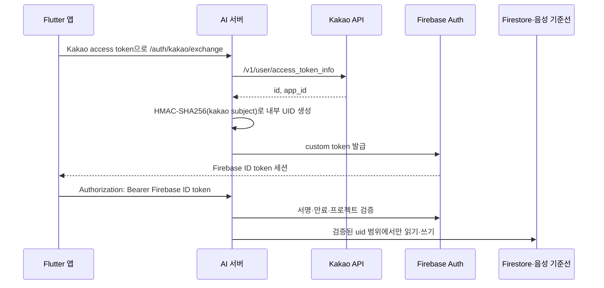

# 사용자 인증과 데이터 소유권 경계

## 결정

마음콜은 카카오 access token을 사용자 데이터 API마다 반복해서 사용하지 않는다. 모바일은 로그인 직후 토큰을 `POST /auth/kakao/exchange`에 한 번 전달하고, AI 서버가 카카오 공식 API에서 토큰의 유효성과 `app_id`를 확인한다. 검증된 카카오 subject는 별도 비밀값으로 HMAC-SHA256 처리해 내부 UID로 바꾸며, Firebase custom token을 발급한다.

이후 모바일과 서버는 Firebase ID token만 사용한다. Firestore 문서와 음성 기준선의 소유자는 클라이언트가 보낸 `user_id`가 아니라 서버 또는 Firestore Security Rules가 검증한 `request.auth.uid`다.

## 책임 경계

| 구성 요소 | 책임 | 신뢰하지 않는 값 |
|---|---|---|
| 모바일 | 카카오 로그인 시작, custom token으로 Firebase 로그인, ID token 전달 | 로컬에 저장된 과거 Kakao ID |
| AI 서버 | 카카오 토큰 audience 검증, 내부 UID 생성, Firebase token 검증 | 요청 body·query의 사용자 ID |
| Firebase Auth | custom token을 ID token 세션으로 교환 | 앱이 주장하는 사용자 UID |
| Firestore Rules | `request.auth.uid == userId` 소유권 강제 | 문서 경로만 맞춘 비인증 요청 |
| PostgreSQL 기준선 저장소 | 서버가 전달한 내부 UID를 다시 저장용 HMAC 키로 가명화 | 외부 공급자 식별값 |

## API 계약

- `POST /auth/kakao/exchange`만 Kakao access token을 받는다.
- 음성 기준선 조회·캘리브레이션·삭제·초기화는 Firebase ID token이 필수다.
- 일반 음성 분석은 익명으로 가능하지만, 기준선을 적용하려면 유효한 Firebase 세션이 필요하다.
- 클라이언트가 `user_id`를 보내 소유자를 선택하는 계약은 제공하지 않는다.
- 인증 설정이 빠진 서버는 readiness의 `authentication` 구성 요소와 503 오류로 배포 문제를 드러낸다.

## 레거시 Firestore 문서 이관

기존 버전은 `users/{Kakao ID}`에 데이터를 저장했다. 새 규칙을 먼저 배포하면 기존 문서에 접근할 수 없으므로 다음 순서를 지킨다.

1. 운영 자격 증명과 운영용 `AUTH_SUBJECT_HMAC_SECRET`을 안전한 비밀 저장소에서 주입한다.
2. 실제 이관 대상만 적은 저장소 밖 manifest로 dry-run을 실행한다.
3. 모든 대상이 `READY` 또는 `ALREADY_COPIED`인지 검토한다.
4. 같은 manifest에 `--apply`를 사용해 문서별 트랜잭션을 실행한다.
5. 모바일 새 버전과 Firestore Security Rules를 배포한다.
6. Firebase Console에서 레거시 문서가 남지 않았는지 별도로 확인한다.

`DESTINATION_CONFLICT`는 자동 병합하지 않는다. 새 UID 문서에 다른 내용이 있다는 뜻이므로 어떤 데이터가 최신인지 업무 판단 후 별도 처리해야 한다. `SOURCE_NOT_FOUND`도 대상을 추측하지 않고 manifest 또는 운영 데이터를 확인한다.

## 오류 경계

| HTTP | 오류 코드 | 의미 |
|---:|---|---|
| 401 | `AUTHORIZATION_REQUIRED` | Bearer token이 필요한 요청 |
| 401 | `AUTHORIZATION_INVALID` | Authorization 헤더 형식 오류 |
| 401 | `KAKAO_TOKEN_INVALID` | 만료되었거나 유효하지 않은 카카오 토큰 |
| 401 | `KAKAO_TOKEN_AUDIENCE_MISMATCH` | 다른 카카오 앱에서 발급된 토큰 |
| 401 | `FIREBASE_TOKEN_INVALID` | 서명·만료·프로젝트 검증에 실패한 Firebase 세션 |
| 403 | `FIREBASE_IDENTITY_PROVIDER_FORBIDDEN` | Firebase 세션은 유효하지만 카카오 identity claim이 없음 |
| 502 | `AUTH_PROVIDER_RESPONSE_INVALID` | 카카오 응답을 계약대로 해석할 수 없음 |
| 503 | `AUTH_PROVIDER_UNAVAILABLE` | 카카오 API 연결 또는 처리 실패 |
| 503 | `AUTH_CONFIGURATION_INVALID` | 서버 인증 환경변수나 Firebase Admin 초기화 오류 |
| 503 | `AUTH_TOKEN_ISSUE_FAILED` | Firebase custom token 발급 실패 |

## 기술 선택 Q&A

### Q. HMAC이 무엇인가?

HMAC은 비밀키와 원문을 함께 넣어 고정 길이 값을 만드는 방식이다. 같은 비밀키와 같은 카카오 subject는 항상 같은 내부 UID가 되지만, 비밀키가 없으면 원래 값을 알아내기 어렵다. 단순 SHA-256은 카카오 ID 후보를 반복 대입할 수 있으므로 여기서는 충분하지 않다.

### Q. HMAC을 사용하면 로그인 검증도 끝나는가?

아니다. HMAC은 식별값을 가명화할 뿐이다. 사용자가 실제로 누구인지 확인하는 인증은 카카오 token 검증과 Firebase ID token 검증이 담당한다. 가명화와 인증은 목적이 다르다.

### Q. 왜 클라이언트의 `user_id`를 받지 않는가?

클라이언트 입력은 수정할 수 있다. 공격자가 다른 사용자의 ID를 body나 query에 넣으면 서버가 그 값을 신뢰하는 순간 타인의 기준선을 조회하거나 삭제할 수 있다. 서버가 검증한 token의 UID만 사용하면 소유자를 클라이언트가 선택할 수 없다.

### Q. 왜 카카오 ID를 Firebase UID로 그대로 쓰지 않는가?

외부 공급자의 실제 식별값이 Firestore 경로, 로그, 백업, 운영 화면에 반복 노출될 수 있기 때문이다. 내부 UID는 서비스 내부 식별과 외부 공급자 식별을 분리해 유출 범위를 줄인다.

### Q. 왜 카카오 토큰을 모든 API에서 계속 검증하지 않는가?

모든 요청이 카카오 API 가용성과 지연 시간에 종속되기 때문이다. 로그인 경계에서 카카오 신원을 확인한 뒤 Firebase 세션으로 교환하면 Firestore와 AI 서버가 같은 UID·만료·서명 체계를 사용하고, 일반 API 호출은 외부 네트워크 없이 검증할 수 있다.

### Q. dry-run은 왜 필요한가?

운영 데이터 이관은 코드가 맞아도 대상 목록이나 환경이 틀릴 수 있다. dry-run은 쓰기 없이 원본 존재 여부와 목적지 충돌을 확인한다. `--apply`를 명시적으로 분리하면 검토와 실제 변경 사이에 승인 지점을 만들 수 있다.

### Q. whitespace는 무엇이며 왜 `strip()`을 사용하는가?

whitespace는 공백, 탭, 줄바꿈처럼 화면에 잘 보이지 않는 문자다. 환경변수나 식별값 앞뒤에 이런 문자가 섞이면 같은 값이 서로 다른 사용자처럼 처리될 수 있다. `strip()`은 값 양끝의 whitespace를 제거한다. 다만 중간 문자는 의미가 달라질 수 있어 임의로 삭제하지 않는다.
