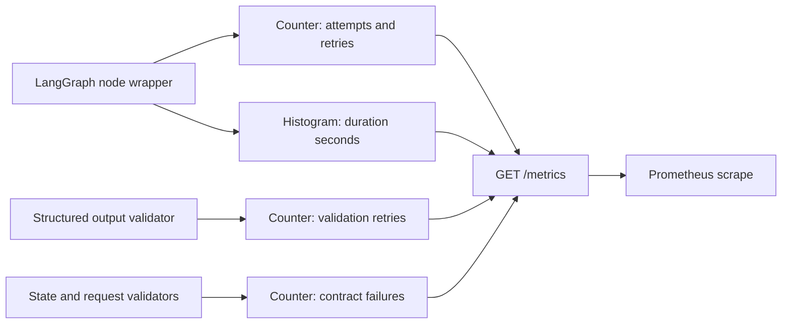

# LangGraph 관측성 설계

## 목표

LangGraph 실행이 느리거나 모델 출력 계약이 반복해서 깨질 때 로그를 직접 뒤져 추측하지 않고 다음 질문에 수치로 답한다.

- 어느 그래프의 어느 노드가 느린가?
- 노드가 성공했는가, 예외로 끝났는가?
- LangGraph 재시도가 실제로 몇 번 실행됐는가?
- 구조화 모델 출력이 JSON·도메인 계약을 몇 번 위반했는가?
- 상태 계약과 HTTP 요청 계약 중 무엇이 주로 실패하는가?

## 선택한 구조

Prometheus Python Client 0.26.0의 Counter와 Histogram을 사용하고 FastAPI의 `GET /metrics`에서 Prometheus text format으로 노출한다.



## 지표 계약

| 지표 | 타입 | 라벨 | 의미 |
|---|---|---|---|
| `maeumcall_langgraph_node_attempts_total` | Counter | `graph`, `node`, `outcome` | 성공·실패를 포함한 노드 실행 시도 수 |
| `maeumcall_langgraph_node_retries_total` | Counter | `graph`, `node` | LangGraph의 1부터 시작하는 시도 번호가 2 이상인 실행 수 |
| `maeumcall_langgraph_node_duration_seconds` | Histogram | `graph`, `node`, `outcome` | 각 노드 시도의 실행 시간 분포 |
| `maeumcall_structured_output_retries_total` | Counter | `operation`, `reason` | JSON 또는 도메인 검증 실패 후 실제 재생성한 횟수 |
| `maeumcall_contract_failures_total` | Counter | `contract`, `code` | 구조화 출력, 시나리오 상태, 요청 본문, HTTP 계약 실패 수 |

사용자 ID, HMAC 키, 요청 ID, 발화 내용, 자유 입력 시나리오명은 라벨에 넣지 않는다. 현재 `graph`, `node`, `operation`, `contract`, `code`, `outcome`, `reason`은 코드에 고정된 유한 값만 사용한다.

## 노드 계측 경계

`add_observed_node`가 기존 노드 함수를 감싸고 다음 순서로 측정한다.

1. 단조 시계인 `perf_counter`로 시작 시각 기록
2. LangGraph `runtime.execution_info.node_attempt` 확인
3. 두 번째 이상 시도이면 재시도 Counter 증가
4. 원래 노드 실행
5. 정상 반환은 `success`, 예외는 `error`로 시도 Counter 증가
6. 성공·실패 모두 Histogram에 실행 시간 기록
7. 예외는 바꾸거나 숨기지 않고 다시 전달

계측 코드는 대체 응답, 기본 상태, 예외 삼키기를 만들지 않는다. 따라서 관측성을 추가해도 그래프의 업무 결과는 바뀌지 않는다.

## 구조화 출력 재시도

`complete_validated_json`은 모델 출력이 JSON 객체가 아니거나 도메인 validator를 통과하지 못했을 때만 교정 사유를 포함해 한 번 더 생성한다.

- 첫 출력이 성공하면 재시도 Counter는 증가하지 않는다.
- 실패 후 실제 다음 생성을 시작할 때만 `maeumcall_structured_output_retries_total`을 증가시킨다.
- 실패한 모든 검증은 `maeumcall_contract_failures_total`에 기록한다.
- 마지막 시도도 실패하면 `RETRIES_EXHAUSTED`를 기록하고 기존 `AIResponseValidationError`를 반환한다.

LangGraph 노드 재시도와 모델 출력 교정 재생성은 원인이 다르므로 별도 지표로 유지한다.

## PromQL 조회 예시

노드별 초당 실행 수:

```promql
sum by (graph, node, outcome) (
  rate(maeumcall_langgraph_node_attempts_total[5m])
)
```

노드별 p95 실행 시간:

```promql
histogram_quantile(
  0.95,
  sum by (le, graph, node) (
    rate(maeumcall_langgraph_node_duration_seconds_bucket[5m])
  )
)
```

구조화 출력 재시도율:

```promql
sum(rate(maeumcall_structured_output_retries_total[5m]))
/
sum(rate(maeumcall_langgraph_node_attempts_total{node="extract_info"}[5m]))
```

계약별 실패 증가량:

```promql
sum by (contract, code) (
  increase(maeumcall_contract_failures_total[1h])
)
```

## 다중 프로세스 운영

일반 실행은 현재 프로세스의 기본 registry를 노출한다. 여러 Python worker를 사용할 때는 운영 시작 스크립트가 프로세스를 띄우기 **전** `PROMETHEUS_MULTIPROC_DIR`을 실제 쓰기 가능한 전용 디렉터리로 설정해야 한다.

- 해당 디렉터리는 매 프로세스 관리자 시작 전에 비워야 한다.
- 애플리케이션 안에서 뒤늦게 환경변수를 설정하지 않는다.
- `/metrics` 요청마다 새 CollectorRegistry와 MultiProcessCollector를 만들어 worker 지표를 합친다.
- 이 프로젝트의 사용자 정의 지표는 다중 프로세스 제약이 적은 Counter와 Histogram만 사용한다.

## 경보 원칙

경보 임계값은 임의의 초·퍼센트로 정하지 않는다. 먼저 실제 트래픽에서 지표를 수집하고 서비스 목표를 정한 뒤 다음 순서로 확정한다.

1. 정상 시간대의 노드별 p50·p95·p99 기준선 확인
2. 사용자가 허용할 응답 시간과 오류율을 SLO로 합의
3. 짧은 순간 증가가 아닌 지속 구간을 경보 조건으로 설정
4. 경보가 가리키는 대응 절차와 담당 범위를 문서화

## 질문과 답

### Q. 관측성이 무엇인가?

시스템 외부에 드러나는 로그, 지표, 추적 정보를 통해 내부 상태를 설명할 수 있는 능력이다. 이번 단위는 그중 집계 가능한 지표를 구현한다.

### Q. 메트릭 또는 지표가 무엇인가?

시간에 따라 수집하는 숫자다. 요청 횟수, 실패 횟수, 실행 시간처럼 비교·집계할 수 있는 운영 데이터를 뜻한다.

### Q. Counter는 무엇인가?

이벤트가 발생할 때마다 증가하는 값이다. 프로세스가 다시 시작되기 전에는 감소시키지 않는다. 실패 수와 재시도 수처럼 누적 횟수에 사용한다.

### Q. Histogram은 무엇인가?

관측한 값을 여러 구간에 나눠 누적하는 지표다. 평균뿐 아니라 p95·p99 같은 지연 시간 분포를 계산할 수 있어 노드 latency에 사용한다.

### Q. bucket은 무엇인가?

Histogram의 값 구간이다. 예를 들어 `le="0.1"` bucket은 0.1초 이하로 끝난 관측 수를 뜻한다. bucket은 누적되므로 더 큰 구간에는 작은 구간의 관측도 포함된다.

### Q. latency는 무엇인가?

작업을 시작한 뒤 결과가 나오기까지 걸린 시간이다. Prometheus 명명 규칙에 맞춰 밀리초가 아니라 기본 단위인 초로 저장한다.

### Q. p95는 무엇인가?

관측값을 빠른 순서로 놓았을 때 95%가 그 값 이하라는 경계다. 평균은 아주 느린 일부 요청을 숨길 수 있어 사용자 체감 지연을 볼 때 p95를 함께 확인한다.

### Q. label은 무엇인가?

같은 지표를 `graph`, `node`, `outcome`처럼 구분하는 키–값이다. PromQL로 특정 노드만 집계할 수 있지만 값 종류가 너무 많으면 저장 비용이 급격히 늘어난다.

### Q. 카디널리티는 무엇인가?

라벨 조합의 가짓수다. 사용자 ID를 라벨에 넣으면 사용자 수만큼 시계열이 생기는 고카디널리티 문제가 발생한다. 그래서 개인 식별 정보와 자유 입력은 라벨로 사용하지 않는다.

### Q. scrape는 무엇인가?

Prometheus 서버가 일정 주기로 애플리케이션의 `/metrics`를 읽어 지표를 가져가는 동작이다. 애플리케이션이 Prometheus로 사용자 요청마다 지표를 직접 전송하지 않는다.

### Q. PromQL은 무엇인가?

Prometheus에 저장된 시계열을 비율, 증가량, 분위수로 계산하는 조회 언어다.

### Q. 재시도는 왜 모든 오류에 적용하지 않는가?

네트워크 순간 장애처럼 다시 실행하면 해결될 수 있는 오류와 잘못된 입력·설정처럼 반복해도 실패하는 오류가 다르기 때문이다. 모든 오류를 재시도하면 응답 시간과 모델 비용만 늘고 실제 원인을 가릴 수 있다.

### Q. 계측 코드가 실패하면 업무 코드도 실패하는가?

Prometheus의 메모리 Counter·Histogram 갱신은 로컬 연산이며 별도 네트워크 호출을 하지 않는다. 계측 wrapper는 원래 노드 예외를 바꾸지 않는다. `/metrics` 수집 실패도 일반 `/chat` 실행 경로와 분리되어 있다.

## 검증 기준

- 성공 노드의 attempt Counter와 duration Histogram count 증가
- 공식 LangGraph RetryPolicy 계약 테스트에서 첫 실패·두 번째 성공과 retry Counter 1 증가
- 구조화 출력 실패 후 실제 재생성 시 retry·contract Counter 증가
- 상태 계약 오류 code별 Counter 증가
- `/metrics` Prometheus text format 응답
- `/metrics`에 `user_id`와 `request_id` 라벨이 없음을 테스트

## 공식 참고 자료

- [LangGraph fault tolerance와 RetryPolicy](https://docs.langchain.com/oss/python/langgraph/fault-tolerance)
- [Prometheus Histogram](https://prometheus.github.io/client_python/instrumenting/histogram/)
- [Prometheus labels](https://prometheus.github.io/client_python/instrumenting/labels/)
- [Prometheus metric and label naming](https://prometheus.io/docs/practices/naming/)
- [Prometheus Python multiprocess mode](https://prometheus.github.io/client_python/multiprocess/)
