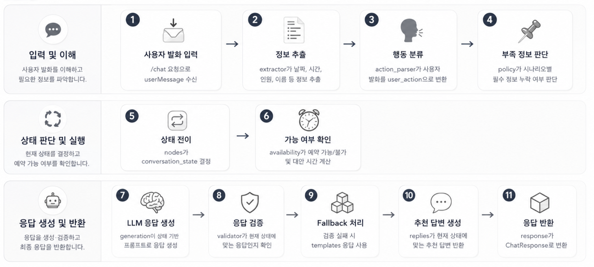

# 📞 Reservation LangGraph

> 마음콜 AI Server의 예약 카테고리 LangGraph 구현 문서이다.  
> 예약 시나리오는 사용자의 발화를 분석하고, 시나리오 상태를 전이하며, LLM 응답과 추천 답변을 생성한다.

  
  
  
  

---

## 📌 목차

1. [개요](#1-개요)
2. [구현 목적](#2-구현-목적)
3. [설계 방향](#3-설계-방향)
4. [공통 처리 흐름](#4-공통-처리-흐름)
5. [지원 시나리오](#5-지원-시나리오)
6. [모듈 역할](#6-모듈-역할)
7. [디렉터리 구조](#7-디렉터리-구조)
8. [시나리오별 구현 요약](#8-시나리오별-구현-요약)
9. [LLM 응답 생성 정책](#9-llm-응답-생성-정책)
10. [테스트 및 검증 결과](#10-테스트-및-검증-결과)
11. [Notion 문서](#11-notion-문서)
12. [구현 결과 요약](#12-구현-결과-요약)

---

## 1. 개요

예약 LangGraph는 마음콜 AI Server에서 예약 전화 상황을 처리하기 위한 상태 기반 대화 흐름이다.

사용자가 통화 상황에서 입력한 발화를 서버로 전달하면, 서버는 현재 시나리오 상태를 기준으로 필요한 정보를 추출하고, 다음 상태를 결정한 뒤 AI 응답과 추천 답변을 반환한다.

이 구조는 병원 예약, 식당 예약, 미용실 예약, 스터디룸 예약처럼 정보 수집과 상태 전이가 중요한 전화 상황을 안정적으로 처리하기 위해 구현되었다.

---

## 2. 구현 목적

예약 전화 시나리오는 단순한 질문-응답 구조가 아니다.

예약을 진행하려면 날짜, 시간, 인원, 이름, 진료과, 시술 종류, 디자이너 등 시나리오별 필수 정보가 필요하며, 사용자가 해당 정보를 한 번에 모두 말하지 않을 수도 있다.

또한 예약 가능 여부 확인, 예약 불가 시 대안 시간 제안, 예약 확정 전 완료 표현 제한처럼 상태에 따라 반드시 지켜야 하는 흐름이 존재한다.

> 🎯 핵심 목표  
> 예약 LangGraph는 LLM이 자연스럽게 대화를 생성하되, 예약 전화에 필요한 상태 흐름과 의미 검증을 서버에서 안정적으로 관리하기 위한 구조이다.

---

## 3. 설계 방향

| 구분 | 설계 방향 |
|---|---|
| 🧠 LLM 응답 | 모든 예약 시나리오에서 LLM 응답을 우선 사용 |
| 🔁 상태 전이 | LangGraph 기반 conversation_state 관리 |
| 🧾 정보 추출 | extractor에서 시나리오별 필수 정보 추출 |
| 🗣 사용자 의도 | action_parser에서 user_action 분류 |
| ⏰ 가능 여부 | availability에서 예약 가능/불가 및 대안 시간 시뮬레이션 |
| 🛡 응답 검증 | validator로 현재 상태에 맞지 않는 LLM 응답 차단 |
| 🧱 안전 응답 | 검증 실패 시 template fallback 사용 |
| 💬 추천 답변 | 현재 상태에 맞는 recommendedReplies 생성 |
| 📦 상태 저장 | scenarioState로 다음 요청에 필요한 상태 유지 |

> 💡 구조 핵심  
> LangGraph는 LLM을 대체하는 구조가 아니라, LLM이 현재 대화 상태를 벗어나지 않도록 상태와 조건을 정리하고 응답 결과를 검증하는 구조이다.

---

## 4. 공통 처리 흐름

예약 시나리오는 사용자의 발화를 입력받은 뒤, 필요한 정보를 추출하고, 현재 상태를 판단한 다음, LLM 응답과 추천 답변을 생성해 반환한다.

  

<table>
  <tr>
    <td>
      <strong>📌 처리 흐름 핵심</strong> 
      예약 LangGraph는 <strong>입력 및 이해 → 상태 판단 및 실행 → 응답 생성 및 반환</strong>의 세 단계로 동작한다.
      extractor, action_parser, policy, availability, validator가 각각 역할을 나누어 LLM 응답이 현재 예약 상태를 벗어나지 않도록 제어한다.
    </td>
  </tr>
</table>

### 4-1. 입력 및 이해

사용자 발화가 `/chat` 요청으로 들어오면, 서버는 먼저 시나리오에 필요한 정보를 파악한다.

- `extractor`는 날짜, 시간, 인원, 이름 등 예약 정보를 추출한다.
- `action_parser`는 사용자의 발화를 `confirm`, `change_time`, `ask_other_time` 같은 `user_action`으로 분류한다.
- `policy`는 현재 상태에서 아직 부족한 필수 정보가 있는지 판단한다.

### 4-2. 상태 판단 및 실행

추출된 정보와 사용자 행동을 기준으로 LangGraph 노드가 다음 상태를 결정한다.

- `nodes`는 `conversation_state`를 결정한다.
- `availability`는 예약 가능 여부와 대안 시간을 계산한다.
- 예약 정보가 부족하면 정보 수집 상태를 유지한다.
- 예약 정보가 충분하면 확인, 가능 여부 조회, 확정, 종료 흐름으로 이동한다.

### 4-3. 응답 생성 및 반환

최종 상태가 정해지면 LLM 응답을 생성하고, 상태에 맞는 응답인지 검증한 뒤 클라이언트로 반환한다.

- `generation`은 현재 상태를 기반으로 LLM 프롬프트를 구성한다.
- `validator`는 LLM 응답이 현재 상태 의미와 맞는지 검증한다.
- 검증 실패 시 `templates`의 안전 응답으로 fallback한다.
- `replies`는 현재 상태에 맞는 추천 답변을 생성한다.
- `response`는 최종 결과를 `ChatResponse`로 변환한다.

---

## 5. 지원 시나리오

| 카테고리 | 시나리오 | LangGraph | 주요 수집 정보 |
|---|---|---|---|
| 예약 | 🏥 병원 예약 | ✅ 지원 | 진료과, 날짜, 시간 |
| 예약 | 🍽 식당 예약 | ✅ 지원 | 날짜, 시간, 인원, 예약자 이름 |
| 예약 | 💇 미용실 예약 | ✅ 지원 | 날짜, 시간, 시술 종류, 디자이너, 예약자 이름 |
| 예약 | 📚 스터디룸 예약 | ✅ 지원 | 날짜, 시작 시간, 이용 시간, 인원, 예약자 이름 |

> ⚠️ 라우팅 기준  
> 예약 카테고리는 category/title 기준으로 정확히 라우팅한다.  
> 단순히 "예약"이라는 단어만 보고 병원 예약 graph로 보내면 식당, 미용실, 스터디룸 예약이 잘못 연결될 수 있기 때문이다.

---

## 6. 모듈 역할

| 파일 | 역할 |
|---|---|
| state.py | LangGraph에서 공유하는 상태 타입 정의 |
| extractor.py | 사용자 발화에서 예약 정보 추출 |
| action_parser.py | 사용자 발화를 user_action으로 분류 |
| policy.py | 필수 정보 누락 여부 판단, 클라이언트 저장 상태 정리 |
| availability.py | 예약 가능 여부와 대안 시간 시뮬레이션 |
| nodes.py | LangGraph 노드 함수 정의 |
| graph.py | LangGraph 노드 연결 및 상태 흐름 구성 |
| generation.py | 상태 기반 LLM 프롬프트 생성, 검증, fallback 처리 |
| llm_client.py | Hugging Face LLM 호출 래퍼 |
| validator.py | 현재 상태에 맞는 응답인지 검증 |
| templates.py | LLM 실패 시 사용할 안전 응답 생성 |
| replies.py | 현재 상태에 맞는 추천 답변 생성 |
| response.py | ChatRequest를 LangGraph에 연결하고 ChatResponse로 변환 |

---

## 7. 디렉터리 구조

예약 LangGraph는 시나리오별 폴더를 분리하고, 공통 router에서 category/title 기준으로 각 graph에 연결한다.

| 경로 | 설명 |
|---|---|
| services/flow/reservation/router.py | 예약 카테고리 안에서 지원 가능한 시나리오 graph로 분기 |
| services/flow/reservation/common/ | 예약 시나리오들이 함께 사용하는 공통 유틸 |
| services/flow/reservation/hospital/ | 병원 예약 LangGraph |
| services/flow/reservation/restaurant/ | 식당 예약 LangGraph |
| services/flow/reservation/hair_salon/ | 미용실 예약 LangGraph |
| services/flow/reservation/study_room/ | 스터디룸 예약 LangGraph |

> 📌 구조 원칙  
> README에서는 전체 파일을 모두 나열하지 않고, 공통 책임 구조와 시나리오 폴더 단위를 중심으로 설명한다.  
> 세부 구현 흐름은 각 시나리오별 문서에서 관리한다.

---

## 8. 시나리오별 구현 요약

### 8-1. 🏥 병원 예약

| 항목 | 내용 |
|---|---|
| 주요 정보 | 진료과, 날짜, 시간 |
| 주요 상태 | asking_department, asking_date, asking_time, confirming_info |
| 가능 여부 | 특정 시간 불가 시 대안 시간 제안 |
| 응답 정책 | LLM 응답 검증 후 fallback 처리 |
| 구현 특징 | 예약 가능/불가/확정 상태별 validator 세분화 |

---

### 8-2. 🍽 식당 예약

| 항목 | 내용 |
|---|---|
| 주요 정보 | 날짜, 시간, 인원, 예약자 이름 |
| 주요 상태 | collecting_reservation_info, confirming_info, reservation_available |
| 가능 여부 | 특정 시간 불가 시 대안 시간 제안 |
| 응답 정책 | LLM 우선, 의미 불일치 시 template fallback |
| 구현 특징 | 예약자 이름 추출과 대안 시간 선택 흐름 포함 |

---

### 8-3. 💇 미용실 예약

| 항목 | 내용 |
|---|---|
| 주요 정보 | 날짜, 시간, 시술 종류, 디자이너, 예약자 이름 |
| 주요 상태 | collecting_reservation_info, confirming_info, reservation_available |
| 가능 여부 | 특정 시간 불가 시 대안 시간 제안 |
| 응답 정책 | LLM 우선, validator 검증 후 fallback |
| 구현 특징 | 디자이너 선택 또는 아무 디자이너 가능 흐름 포함 |

---

### 8-4. 📚 스터디룸 예약

| 항목 | 내용 |
|---|---|
| 주요 정보 | 날짜, 시작 시간, 이용 시간, 인원, 예약자 이름 |
| 주요 상태 | collecting_reservation_info, confirming_info, reservation_available |
| 가능 여부 | 특정 시작 시간 불가 시 대안 시간 제안 |
| 응답 정책 | LLM 우선, 일부 안전 조건은 template 보정 |
| 구현 특징 | 시작 시간과 이용 시간을 분리해서 처리 |

---

## 9. LLM 응답 생성 정책

예약 LangGraph는 모든 예약 시나리오에서 LLM 응답을 우선 사용한다.

다만 예약 도메인은 상태 의미가 중요하기 때문에, LLM이 현재 상태와 어긋나는 문장을 생성하면 validator와 template fallback으로 응답을 보정한다.

### 원칙 1. LLM 응답을 먼저 생성한다

예약 시나리오의 응답은 정형 문장만 사용하지 않는다.

사용자가 실제 전화처럼 자연스럽게 연습할 수 있도록, 현재 상태와 수집된 정보를 기반으로 LLM 응답을 먼저 생성한다.

### 원칙 2. 상태별 validator로 의미를 검증한다

LLM 응답은 자연스럽지만, 항상 현재 상태에 맞는다는 보장은 없다.

따라서 각 시나리오의 `validator.py`에서 현재 `conversation_state`에 맞는 최소 의미를 검증한다.

예를 들어 예약 가능 상태에서는 “가능” 의미가 필요하고, 예약 불가 상태에서는 “어렵다”, “마감”, “불가능”처럼 불가 의미가 필요하다.

### 원칙 3. 검증 실패 시 template fallback을 사용한다

LLM 응답이 현재 상태와 맞지 않거나, 예약 흐름을 혼동하게 만들 수 있으면 해당 응답을 그대로 사용하지 않는다.

이 경우 `templates.py`에 정의된 안전 응답을 fallback으로 사용한다.

이를 통해 자연스러운 응답과 안정적인 상태 흐름을 함께 유지한다.

### 원칙 4. 예약 확정 전에는 완료 표현을 제한한다

예약이 아직 확정되지 않은 상태에서 LLM이 “예약 완료됐습니다”처럼 말하면 상태 흐름이 깨질 수 있다.

따라서 `reservation_confirmed` 상태 이전에는 예약 완료, 예약 확정 같은 표현을 사용하지 않도록 검증한다.

예약 가능 상태에서는 “예약 가능합니다. 이 시간 괜찮으세요?”처럼 사용자의 최종 확인을 받는 흐름을 유지한다.

### 원칙 5. 가능/불가 의미를 명확히 전달한다

예약 가능 여부는 사용자가 반드시 이해해야 하는 핵심 정보이다.

따라서 예약 가능 상태에서는 가능한 시간임을 명확히 안내하고, 예약 불가 상태에서는 요청한 시간이 어렵다는 의미를 분명히 전달한다.

대안 시간이 있는 경우에는 가능한 대안 시간을 함께 안내한다.

<table>
  <tr>
    <td>
      <strong>⭐ LLM 활용 기준</strong> 
      LLM은 대화를 자연스럽게 이어가는 역할을 한다.
      LangGraph는 LLM을 대체하는 것이 아니라,
      LLM이 현재 예약 상태를 벗어나지 않도록 조건을 제공하고 결과를 검증하는 구조이다.
    </td>
  </tr>
</table>

---

## 10. 테스트 및 검증 결과

| 테스트 구분 | 검증 내용 |
|---|---|
| 🧩 Action Parser Test | 사용자 발화를 user_action으로 올바르게 분류하는지 검증 |
| 🧾 Extractor Test | 날짜, 시간, 인원, 이름 등 정보 추출 검증 |
| 🔁 Graph Flow Test | 상태 전이, 예약 가능/불가, 확정/종료 흐름 검증 |
| 🚦 Routing Test | category/title 기준으로 올바른 graph에 연결되는지 검증 |
| 🛡 Validator Test | LLM 응답이 상태 의미와 맞는지 검증 |

| 구분 | 결과 |
|---|---|
| 예약 관련 테스트 | ✅ 165 passed |
| 경고 | LangGraph serializer 관련 warning 1건 |
| 실패 테스트 | 없음 |

대표 테스트 명령은 다음과 같다.

`python -m pytest tests/test_hair_salon_reservation_action_parser.py tests/test_hair_salon_reservation_extractor.py tests/test_hair_salon_reservation_graph_flow.py tests/test_hair_salon_reservation_graph_routing.py tests/test_study_room_reservation_action_parser.py tests/test_study_room_reservation_extractor.py tests/test_study_room_reservation_graph_flow.py tests/test_study_room_reservation_graph_routing.py tests/test_restaurant_reservation_action_parser.py tests/test_restaurant_reservation_extractor.py tests/test_restaurant_reservation_graph_flow.py tests/test_restaurant_reservation_graph_routing.py tests/test_reservation_graph_router.py tests/test_hospital_reservation_action_parser.py tests/test_hospital_reservation_graph_flow.py -v`

---

## 11. Notion 문서

| 시나리오 | Notion 문서 |
|---|---|
| 🏥 병원 예약 | https://www.notion.so/LangGraph-36286270a25480cfb7fdfcd8d1a3375c |
| 🍽 식당 예약 | https://www.notion.so/LangGraph-37486270a254802e8e3fe68f06f90478 |
| 💇 미용실 예약 | https://www.notion.so/LangGraph-37886270a25480b7a57ceaae8c62eea9 |
| 📚 스터디룸 예약 | https://www.notion.so/LangGraph-37886270a25480c09a96eb4958ee11ef |

> 📝 문서 관리 방식  
> Trouble Shooting은 별도 공통 링크로 분리하지 않고, 각 시나리오별 Notion 페이지 내부에서 함께 관리한다.

---

## 12. 구현 결과 요약

| 구분 | 결과 |
|---|---|
| LangGraph 적용 범위 | 병원, 식당, 미용실, 스터디룸 예약 |
| LLM 응답 정책 | 모든 예약 시나리오에서 LLM 우선 사용 |
| 상태 안정성 | validator와 template fallback으로 상태 의미 보정 |
| 예약 가능 여부 | availability simulator로 가능/불가 및 대안 시간 처리 |
| 프론트 전달 상태 | scenarioState, conversationState, recommendedReplies, shouldEndCall 반환 |
| 테스트 검증 | 예약 관련 테스트 165개 통과 |

> ✅ 구현 성과  
> 예약 카테고리는 단순 LLM 응답 구조에서 벗어나, 시나리오별 상태 전이와 응답 검증을 갖춘 LangGraph 기반 대화 흐름으로 확장되었다.  
> 이를 통해 사용자가 정보를 한 번에 말하지 않아도 대화를 이어갈 수 있고, 예약 가능 여부와 확정 흐름도 안정적으로 관리할 수 있다.

---

  <strong>Reservation LangGraph</strong> 
  자연스러운 LLM 응답과 안정적인 상태 전이를 함께 고려한 예약 전화 시나리오 구조이다.

